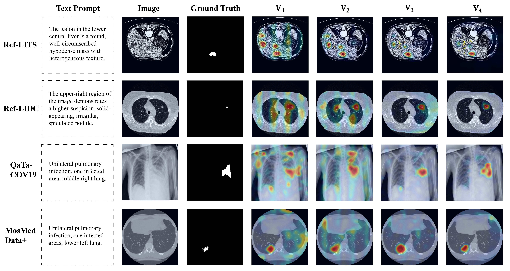
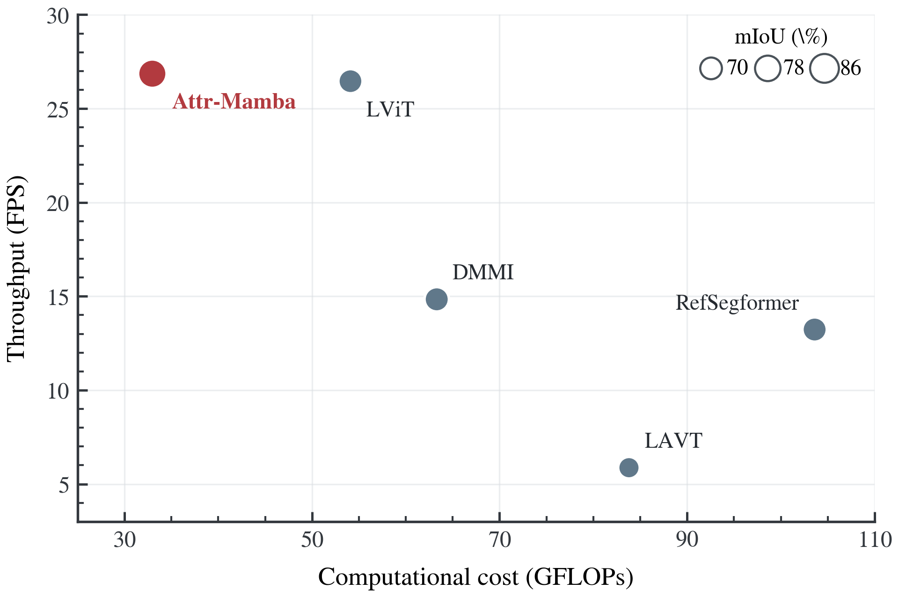

# Attr-Mamba

Official implementation of **Attr-Mamba: Attribute-Guided State-Space Model for Progressive Medical Referring Image Segmentation**.

Attr-Mamba addresses Medical Referring Image Segmentation (Medical RIS), where a model segments a target region from a medical image according to a clinical-style referring description. The method combines sentence-level global calibration with token-level local vision-language interaction in a cascaded state-space decoder, progressively refining target localization and lesion boundaries.

## Highlights

- Progressive Medical RIS across liver CT, lung CT, chest X-ray, and chest CT data.
- Anatomy-guided Semantic Calibration Module (SCM) for sentence-level global referring guidance.
- Morphology-aware Boundary Delineation Module (BDM) for token-level local vision-language state-space interaction.
- Audited Ref-LITS and Ref-LIDC descriptions with a public dataset construction protocol.
- Reproducible evaluation without connected-component selection or hidden mask post-processing.

## Method

<p align="center">
  
</p>

<p align="center"><b>Overall framework.</b> A cascaded decoder alternates SCM-based global calibration and BDM-based local vision-language refinement before multi-stage feature fusion and mask prediction.</p>

<p align="center">
  
</p>

<p align="center"><b>Core modules.</b> SCM applies text-conditioned AdaLN modulation and gated SS2D residual injection. BDM concatenates local visual windows with token-level text for state-space interaction and text-state updating.</p>

## Installation

Python 3.10 is recommended. Building the selective-scan extension requires a CUDA toolkit compatible with the installed PyTorch version.

```bash
conda create -n attr-mamba python=3.10
conda activate attr-mamba
pip install -r requirements.txt
cd selective_scan
pip install .
cd ..
```

Pretrained encoders:

- RadBERT: provide a Hugging Face model ID or local path with `--bert_path`.
- Swin-T: provide the ImageNet-1K pretrained checkpoint with `--swin-pretrained`.

## Repository Structure

```text
Attr_Mamba/
|-- main.py                 # Training and evaluation entry point
|-- engine.py               # Optimization and metric computation
|-- model/                  # Attr-Mamba and Swin-T implementation
|-- vmamba_model/           # State-space building blocks
|-- selective_scan/         # CUDA selective-scan extension
|-- ref_dataset/            # Medical referring segmentation loader
|-- datasets/               # Released Ref-LITS and Ref-LIDC descriptions
|-- dataset_protocol/       # Prompt, schemas, filtering, validation, and audited text
`-- assets/figures/         # README figures
```

## Data Preparation

The original medical images and masks should be obtained from their respective dataset providers. Split metadata consumed by the loader should contain image paths, mask paths, referring text, and stable sample identifiers. Dataset splitting must be completed at the CT-volume or patient/scan level before triplet generation.

The released clinical-style descriptions are:

| File | Records | Scope |
| --- | ---: | --- |
| `datasets/Ref-LITS_descriptions.json` | 14,883 | Liver lesion descriptions |
| `datasets/Ref-LIDC_descriptions.json` | 8,721 | Pulmonary nodule descriptions |

The complete public protocol is documented in [`dataset_protocol/`](dataset_protocol/README.md). It includes representative generation prompts, attribute schemas, filtering rules, validation scripts, examples, and audited copies of the released descriptions.

## Training and Evaluation

Example distributed training on Ref-LITS:

```bash
torchrun --nproc_per_node=2 main.py \
  --distributed \
  --model AttrMamba \
  --data-set ref-lits \
  --data-path ./data/Ref-LITS \
  --json-prefix ref_lits \
  --image-size 512 \
  --output_dir ./outputs/ref_lits \
  --batch_size 4 \
  --epochs 200 \
  --lr 1e-4 \
  --weight-decay 0.05
```

Evaluation:

```bash
python main.py \
  --eval \
  --model AttrMamba \
  --data-set ref-lits \
  --data-path ./data/Ref-LITS \
  --json-prefix ref_lits \
  --test-split test \
  --image-size 512 \
  --resume ./outputs/ref_lits/best_checkpoint.pth
```

QaTa-COV19 and MosMedData+ use `--image-size 224`. Evaluation thresholds raw sigmoid outputs at `0.5` and reports mIoU, mDice, oIoU, and HD95. No connected-component selection is applied. To export qualitative predictions, add `--vis-dir <output-directory>`.

## Main Results

| Dataset | mIoU | mDice | HD95 | Summary |
| --- | ---: | ---: | ---: | --- |
| Ref-LITS | **69.62** | **78.41** | **10.20** | +6.08 mIoU over the second-best method |
| Ref-LIDC | **63.44** | **76.07** | **7.04** | +1.82 mIoU over the second-best method |
| QaTa-COV19 | **85.83** | **92.35** | **11.63** | Best mIoU, mDice, and reported HD95 |
| MosMedData+ | **66.51** | 79.61 | **13.19** | Best mIoU and reported HD95 |

<p align="center">
  
</p>

<p align="center"><b>Qualitative comparison.</b> Yellow, red, and green denote true positives, false negatives, and false positives, respectively.</p>

## Ablation Studies

### SCM and BDM

| SCM | BDM | Ref-LITS mIoU | Ref-LIDC mIoU | QaTa-COV19 mIoU | MosMedData+ mIoU |
| --- | --- | ---: | ---: | ---: | ---: |
| No | No | 57.11 | 53.96 | 74.06 | 58.23 |
| Yes | No | 59.73 | 55.93 | 76.60 | 60.01 |
| No | Yes | 62.94 | 57.07 | 78.13 | 61.36 |
| Yes | Yes | **69.62** | **63.44** | **85.83** | **66.51** |

### Progressive Stages

| Stages | mIoU | mDice | HD95 | Params (M) | GFLOPs | Latency (ms) | FPS |
| ---: | ---: | ---: | ---: | ---: | ---: | ---: | ---: |
| 1 | 65.51 | 74.72 | 13.89 | 184.16 | 211.70 | 45.15 | 22.15 |
| 2 | 66.72 | 76.03 | 12.94 | 185.85 | 212.21 | 47.83 | 20.91 |
| 3 | 68.03 | 77.46 | 11.72 | 192.12 | 213.89 | 53.92 | 18.54 |
| 4 | **69.62** | **78.41** | **10.20** | 216.20 | 219.89 | 59.34 | 16.85 |

<p align="center">
  
</p>

<p align="center"><b>Stage-wise heatmaps.</b> Spatial responses evolve from broad candidate regions to concentrated activations around referred lesions.</p>

## Computational Efficiency

<p align="center">
  
</p>

On QaTa-COV19 at 224 x 224, Attr-Mamba requires 32.97 GFLOPs and reaches 26.88 FPS. All throughput and computational-cost measurements use the same hardware, batch size, and timing protocol for the compared implementations.

Recreate the figure with `python tools/plot_efficiency_tradeoff.py` (Matplotlib required).

## Attribute-Specific Prompt Intervention

Controlled subsets contain 300 test cases from each of Ref-LITS and Ref-LIDC. Spatial substitutions are restricted to multi-lesion cases, while morphology substitutions modify one shape-, boundary-, or density-related descriptor. The remaining text and target masks are unchanged, and all intervened prompts are manually reviewed.

| Dataset | Prompt | mIoU | Center Distance | Boundary F-score | HD95 |
| --- | --- | ---: | ---: | ---: | ---: |
| Ref-LITS | Original | **76.96** | **2.15** | **78.00** | **6.19** |
| Ref-LITS | Spatial | 45.78 | 80.34 | 42.00 | 86.54 |
| Ref-LITS | Morphology | 70.35 | 12.91 | 68.00 | 19.14 |
| Ref-LIDC | Original | **67.59** | **4.18** | **84.00** | **6.56** |
| Ref-LIDC | Spatial | 31.74 | 92.21 | 49.00 | 92.41 |
| Ref-LIDC | Morphology | 62.69 | 6.71 | 76.00 | 9.23 |

## Robustness to Clinical and Noisy Text

Five radiologists independently rephrased 100 sampled test cases per dataset, yielding 500 rewritten descriptions for inference with fixed model parameters. Separately, the original prompts were perturbed by word/phrase replacement, key-modifier omission, and irrelevant phrase insertion.

| Dataset | Setting | mIoU | mDice | CD (px) | BF | HD95 (px) |
| --- | --- | ---: | ---: | ---: | ---: | ---: |
| Ref-LITS | Original | **75.15** | **85.37** | **1.77** | **69.28** | **4.91** |
| Ref-LITS | Clinical Text | 72.37 | 82.46 | 4.74 | 65.88 | 8.29 |
| Ref-LITS | Noise 10% | 69.14 | 79.34 | 12.17 | 61.80 | 15.04 |
| Ref-LITS | Noise 20% | 65.59 | 76.08 | 16.48 | 58.63 | 18.63 |
| Ref-LITS | Noise 30% | 61.34 | 71.71 | 23.37 | 55.92 | 22.38 |
| Ref-LIDC | Original | **60.89** | **74.78** | **1.12** | **86.68** | **2.89** |
| Ref-LIDC | Clinical Text | 60.35 | 74.20 | 2.55 | 85.73 | 4.36 |
| Ref-LIDC | Noise 10% | 58.17 | 71.97 | 8.08 | 83.20 | 10.03 |
| Ref-LIDC | Noise 20% | 56.09 | 69.58 | 14.50 | 80.62 | 16.46 |
| Ref-LIDC | Noise 30% | 54.57 | 67.80 | 19.50 | 78.28 | 17.48 |

## Reproducibility Notes

- Splits are read exactly from the supplied metadata; the loader does not create or modify them.
- Images are resized with bilinear interpolation and normalized with ImageNet statistics; masks use nearest-neighbor interpolation.
- Random augmentation, small-target filtering, and connected-component target selection are disabled in the released loader.
- The total loss is Dice loss plus Focal loss and `0.1 * L_bound`, with boundary weighting `W = 1 + 5B`.
- Set `--seed` to reproduce a run under the same software and hardware configuration.

## Acknowledgements

This implementation builds on Swin Transformer, RadBERT, VMamba/Mamba-style selective scanning, and prior referring image segmentation codebases. We thank their authors and maintainers.
